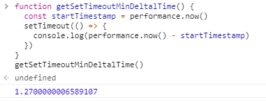

# setTimeout 最小延时

我们都知道这样一句话： “setTimeout 最小时延是 4ms”。

为了验证是否正确：

```js
function getSetTimeoutMinDeltalTime() {
  const startTimestamp = performance.now();
  setTimeout(() => {
    console.log(performance.now() - startTimestamp);
  });
}
getSetTimeoutMinDeltalTime();
```



发现，比 4ms 要小。其实这个最小时间间隔 4ms 是有条件的：

- If timeout is less than 0, then set timeout to 0.
- If nesting level is greater than 5, and timeout is less than 4, then set timeout to 4.
- Increment nesting level by one.
- Let task's timer nesting level be nesting level.

也就是说，嵌套超过 5 层，并且 delay 小于 4 时，才会设置成 4ms。

如果不满足这个条件，具体的行为是：

```c++
static const double minimumInterval = 0.004;
static const int maxTimerNestingLevel = 5;

DOMTimer::DOMTimer(ExecutionContext* context, PassOwnPtrWillBeRawPtr<ScheduledAction> action, int interval, bool singleShot, int timeoutID)
    : SuspendableTimer(context)
    , m_timeoutID(timeoutID)
    , m_nestingLevel(context->timers()->timerNestingLevel() + 1)
    , m_action(action)
{
    ASSERT(timeoutID > 0);
    if (shouldForwardUserGesture(interval, m_nestingLevel))
        m_userGestureToken = UserGestureIndicator::currentToken();

    // 1ms 和 用户设置的 delay 时间取个最大值
    // 不满足下面的 if 时， 最小间隔是 1ms
    double intervalMilliseconds = std::max(oneMillisecond, interval * oneMillisecond);
    // 设置的delay < 0.004 && 嵌套层级 >= 5  这时会用 0.004
    if (intervalMilliseconds < minimumInterval && m_nestingLevel >= maxTimerNestingLevel)
        intervalMilliseconds = minimumInterval;
    if (singleShot)
        startOneShot(intervalMilliseconds, FROM_HERE);
    else
        startRepeating(intervalMilliseconds, FROM_HERE);
}
```

可以看到，如果嵌套比较小 Chrome 最小时间间隔是 `1ms` 。和规范不同的是，规范是 `nesting level > 5`, 但 Chrome 却是 `nesting level >= 5`

另外，一些浏览器为了优化后台 tab 的加载损耗（以及降低耗电量），在未被激活的 tab 中定时器的最小延时限制为 1S(1000ms)。不过可以通过修改以下属性来更改：

- dom.min_tracking_timeout_value: 4
- dom.min_tracking_background_timeout_value: 10000
- dom.timeout.tracking_throttling_delay: 30000

> 当 Web Audio API AudioContext 正在被用来播放音频的时候，Firefox 50 不会再限制后台 tabs 的加载。 后续的 Firefox 51 版本修正了这个问题，即使在没有音频播放的情况下，也不再限制后台 tabs 的加载。这个解决了一些软件应用在后台 tabs 中播放基于文本的音频( note-based) 时，无法去同步音频和画面的问题。

[更多细节原因](https://juejin.cn/post/6846687590616137742)
