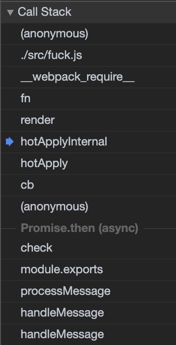

# 流程

```js
const { HotModuleReplacementPlugin } = require('webpack')
const config = {
  plugins: [
    new HotModuleReplacementPlugin()
  ],
  devServer: {
    port: 8080
    hot: true
  },
}
```
HotModuleReplacementPlugin 这个插件会在入口处添加几个文件，作用就是在打包后的文件中添加一些HMR用到的全局函数。




`webpack-hot-middleware` 会在 `/__webpack_hrm` 下建立一个SSE server，webpack打包时会给client发送message。

client则会监听message事件，回调函数也就是上图中的 handleMessage，在action是sync、built的时候会请求最新的模块文件。

在接收到新模块文件后，webpack会向上遍历接收update的文件，所谓接受update文件就是看哪个模块执行了 `module.hot.accept()`,应该见过这个：
```js
if (module.hot) {
  module.hot.accept(['path/fuck.js'], render)
}
```
确定接收更新的文件后，停止冒泡。

最后会 `__webpack_require__(newModule)`, 执行最新的module，跑runder，完成局部更新。

自己写一个DevServer的话就是这样：
```js
const express = require('express')
const devMiddleware = require('webpack-dev-middleware')
const hotMIddleware = require('webpack-hot-middleware')
const webpack = require('webpack')
const config = require('./config')

const compiler = webpack(config)

app.use(devMiddleware(compiler, {
  publicPath: config.output.publicPath
}))

app.use(hotMiddleware(compiler, {
  path: '/__webpack_hmr'  // SSE path
}))

app.listen(config.devServer.port, () => {
  console.log('Your app is running here: http://localhost:${port}')
})
```
不过config那里需要添加一点：
```js
const { }
const config = {
  entry: [
    'webpack-hot-middleware/client',
    path.resolve(__dirname, '../src/index.js')
  ],
  plugins: [
    new HotModuleReplacementPlugin()
  ]
}
```
> `webpack-hot-middleware/client` 是和client建立SSE链接， `HotModuleReplacementPlugin` 则是在打包后的文件中添加一些HMR需要的函数

+ wdm 职责主要就是负责把 outputFIleSystem 弄成 memery-fs
+ whm 职责是建立SSE链接
+ HotModuleReplacementPlugin 注入runtime code

所以 `webpack-dev-server` 其实就是集成了wdm、whm。大概思想就是这样 他妈的太费劲