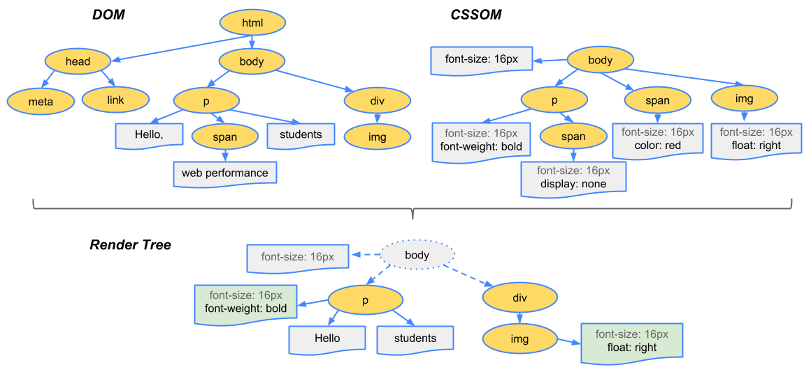
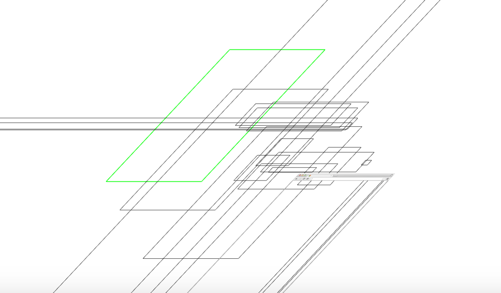

# 背景

最近写的管理系统中涉及到同时渲染数千/万个`DOM`元素，即使`vue`中通过`Virtual DOM`和`diff`已经优化了`DOM`的操作，但还是肛不过元素太多。页面比较卡顿，所以对性能优化这里做了一个简单的了解。

# 为什么说操作 DOM 慢呢？

人云亦云，`JavaScript`快 操作`DOM`持久（慢），所以男人还是要操作`DOM` 不要当`JavaScript`。（我就是要开车，不然生活太无趣）。

浏览器在接受到 html 的数据之后就会：`binary data` => `character` => `fragment` => `node` => `DOM`。于此同时还会对`CSS`进行解析，生成`CSSOM`。


然后将`DOM`和`CSSOM`合并为`render tree`, `render tree`存储着每个元素确切的样式信息（由相对值计算为绝对值），然后进行`layout`、`paint`、`composition`最后生成了我们看到的页面。

在生成页面之后，用户与页面交互`js`操作`DOM`、样式等又会改变元素的样式信息，这样浏览器就不得不再次`layout`、`repaint`、`composition`刷新页面。这个过程其实是非常耗费性能的。

而 js 操作`DOM`会慢的原因就是，如果我们在更改`DOM`的样式信息后，又获取`DOM`的某些信息，浏览器为了得到更新后正确的信息，就会`layout`、`repaint`、`composition`。试想一下，如果一个循环里一值在干这种事，那循环结束浏览器相当于干了好多次重排、重回、整合图层。性能肯定是底下的。

### 如何解决这一问题

批量操作！

上面说到我们在循环里如果频繁的操作`DOM`、更改、获取样式就会多次重排重绘。其实我们可以把获取样式的操作等到更改信息结束之后再执行，因为浏览器之所以要重新走一遍流程，是因为我们更改`DOM`样式之后又获取属性 浏览器为了确定最终正确的值必须要根据你更改的值来重新计算。而等到更改操作结束，我们只读是不会引起重排重绘的。

## 优化渲染

上面提到的知识`js`频繁操作`DOM`引起的性能问题。在渲染层面也是可以优化的，比如：

```js
// 意思意思，什么setTimeout模拟大家都知道，就不扯了
setInterval(() => (div.style.left = prev++ + 'px'), 3);
```

我们想让它每`3ms`就向右移动`1px`。但是如果这么写你会发现页面的动画会有卡顿，难道这也是重排重绘的锅吗？总不能不操作`DOM`吧，那我他妈干脆别玩动画得了。

因为`setTimeout`（`setInterval`，知道啥意思就行了）的 cb 是在主线程空闲的时候执行，那有可能在一帧中执行很多次，因为一帧要完成的任务（有的步骤可能不执行）是：**执行 js => 计算 style => layout => paint => composition**。执行完这些就会去执行`setTimeout`，这样有可能在下一帧被浏览器渲染为视图之前，`setTimeout`又执行了好几次，每一次都会重排重绘。等到 16.6ms 之后我们的 left 已经被修改了好几次了。可是视图只更新了最终那一次，就造成了丢帧的情况。也就是`setTimeout`、`setInterval`的卡顿的原因所在了。


于是就有了我们的`requestionAnimationFrame`,这个`API`由浏览器（系统）去调用，它的调用时机不是主线程空闲就调用，而是在浏览器开始渲染下一帧最开始调用，在这个`API`里去操作`DOM`就不会造成掉帧的情况，而且执行完以后浏览器刚好再继续 style => layout 等等。。 就不会因为我`setTimeout`打乱了原先的信息，而不止一次地重排重绘了。

> 浏览器的刷新频率为`60fps`，浏览器一连串的操作都得在`16.6ms`内完成，否则就会掉帧。如果掉帧次数过多就会感到明显的卡顿。

### 详细说一下 执行 js => 计算 style => layout => paint => composition

- 执行 js：略
- style：计算元素的确切样式信息
- layout：计算元素确切尺寸信息
- paint：将元素绘制到图层上
- composition：将各个图层合并到一起
  > 上述步骤不一定在每一帧都会全部执行，如果`js`没有干坏事儿（改变页面有关的操作）就不会走 style => layout => paint 等。比如我只修改了颜色，就不会去`layout`，只会`repaint`。而如果我改了 top、width 等，就得都走一遍了。

### 将动画、渐变扔到单独的图层

我们都知道通过`transfrom、opacity、transition`可以开启所谓的硬件加速（不太对），这样在当前图层的信息修改后只需要由`GPU`去更改那个图层再`composition`就可以了。

> 一般用 transform: transfromZ(0)、will-change: transform；



- 动画使用`transform`、`opacity`来完成（不需要`layout`、`repaint`，只需`composition`）；
  > 说`transform`、`opacity`不需要`layout`、`repaint`，只需`composition`是针对动画而言的，如果在动画过程中修改了尺寸、颜色，那它所在的图层依然是需要的。

## 复杂纯计算的任务交由 web worker

就提一下，具体`API`的使用应该在[js](../js)目录下会写。

反之，如果把这些活让`js`去计算，那就爽歪歪了。还有一些属性，比如：`text-shadow`、`filter`、`box-shadow`等的效果在重新绘制期间更加复杂，所以使用的时候也要节制。

## 何为 GPU 硬件加速？

上面已经说了，通过硬件加速，让某些元素单独拎出来为一层。只需使用`GPU`中存储的 texture（矩阵像素点集合），对这个矩阵进行多种变换以得到新图层，最后由`GPU`去`composition`到一起，跳过了`repaint`、`layout`的步骤，以此加速了网页的渲染。

> `GPU`的加速，是让原本就存在于`GPU`的图层进行一些变换（通过矩阵变换得到信息等），得到新的图层。跳过了`layout`、`repaint`的步骤。但是如果某个图层的某个属性，比如 color、width 更改了，那这个图层依然是需要重排重绘的。这个时候就算开启了硬件加速，也得走完整的步骤了（只不过重排重绘的任务量只是这个图层的而已，应该还是要比不开启加速要好一些的！我猜(⊙v⊙)嗯）。

但是这么做是有代价的。每多一个图层，就需要开辟一段内存去存储有关信息，而且合并多个图层也是需要耗费性能的。一旦图层过多这个任务就会变得难以完成，依然会造成卡顿，反而降低了性能。

总结一下，所谓硬件加速的意思就是：浏览器早期完全通过软件来绘制页面，如今在合适的时候浏览器会自动去使用`GPU`（不是由开发者指定）。`GPU`的功能是在合并图层的阶段，可以对原图层直接进行一些变换（合理利用这个变换是可以跳过`layout`、`repaint`），使得每一帧消耗的时间最少，避免卡顿。
