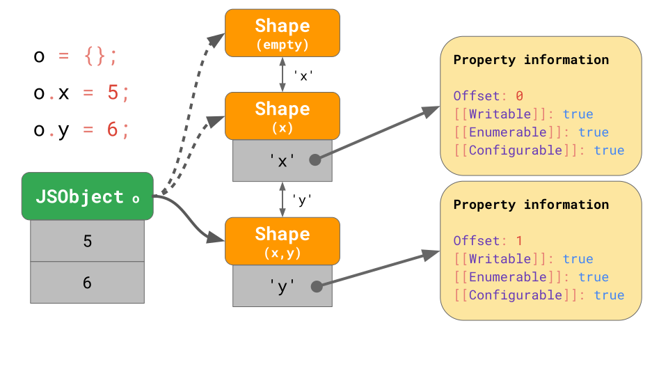

# javascript对象模型
ECMAScript规范将所有对象定义为由字符串键值(那symbol也是吗？)映射到property属性的字典。


# 属性访问优化
## shapes
有很多js对象，他们的形状是类似的，就是：
```ts
const obj0 = {
  name: 'Bruce',
  identity: 'BAT MAN',
}

const obj1 = {
  name: 'clark',
  identity: 'Super man'
}
```
而且很多操作都是对类似对象取同一个属性。考虑到这一点，引擎会基于对象的结构/形状来对取得对象属性进行一些优化。

比如现在要读取`obj0.name`,引擎会先从JSObject中查找到对应的key，然后返回其value。那对象在内存又是如何存储的呢？我们都知道js的引用类型变量都是存储在堆上的，但其他的好像知道的很少，因为js不允许开发者直接访问内存。

那这些对象应不应该存储为JSObject的一部分，如果是形状完全相同的对象如果存储很多遍是不是有点浪费（因为相同的key存储了多遍）。因此，引擎将对象的shape分开存储。


可以看到shape中存储了除过value以外的所有对象属性的信息，其中的offset则记录的对象的value在JSObject中的偏移量，这样就能根据这个offset去找到属性的值了。以后每个具有相同shape的对象都指向同一个shape实例，JSObject当中只存储对应的value即可。


这下只要对象的shape一样，不管有多少个对象，在内存当中都只把这个形状的信息存储一次，然后值分开存。
> 所有的js引擎都对shape进行了优化。关于`shapes`优化学术上叫做`hidden classes`；V8叫做`Maps`；JSCore叫做`Structures`；spiderMonkey叫做`shapes`。

## transition链和树
上面说道具有相同shapes的对象在内存中，值是一个JSObject，其中存储了各个属性的值以及对应shapes实例的引用。对应的key则存储在shapes的实例之中。那么，如果我给对象新添一个属性怎么办呢？

在JavaScript引擎中，shapes的组织形式是以链表来组织的。

可以看到，每增加一个属性，对应的JSObject中增加对应属性的value，然后将自己的shape指向新的shape即可。图中是新建了一个shapes的实例，不过其实不用完全摒弃掉之前的shapes实例，可以通过新增一个shapes，这个实例仅存储我们多出来的属性即可，原先的属性还是从之前的shapes中去找，通过链表将这些个shapes的实例组织到一起，查找的时候遍历即可。


但是还有问题，上面只是说我某个对象新添的了一个属性这么做没有问题，但是如果使用同一个shapes实例的多个JSObject分别新增了不同的key，那怎么办？很简单，一样的部分还是和链表一样，对于不同的key，新建多个，然后以树的形式组织起来，遍历由链表的遍历更改为树的遍历即可。


> 上面的例子是从一个空对象开始的，但事实上root不一定是{},可以直接就是一个最小的交集shape。

# inline caches
shapes背后的主要动机是ICs，看一下下面的操作：
```js
function getX(x) {
  return obj.x
}
console.log(getX({x: 0}))
```
按照前面的做法，如果想要取到对象的x属性，引擎应该这么做：

根据对象的结构（shapes）找到shapes实例，然后遍历这个shapes（有可能是多个，树），查找到x这个key对应的property information，读取其中的offset，然后在众多的JSObjects当中，根据offset从当前的JSObject得到我们想要的属性的value。

在这个过程中

# 参考（照抄）
[[译] JavaScript 引擎基础：Shapes 和 Inline Caches](https://hijiangtao.github.io/2018/06/17/Shapes-ICs/)