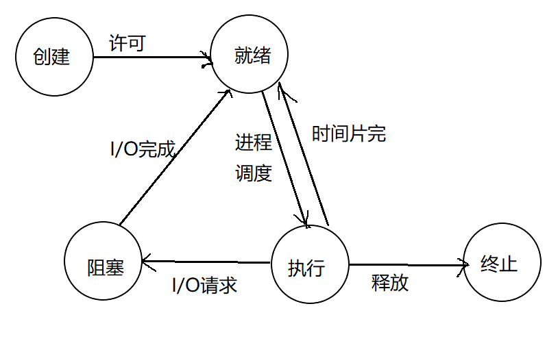
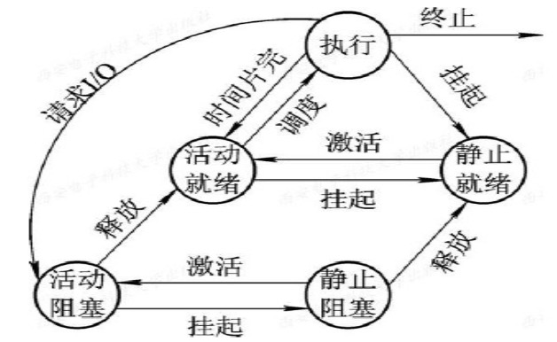
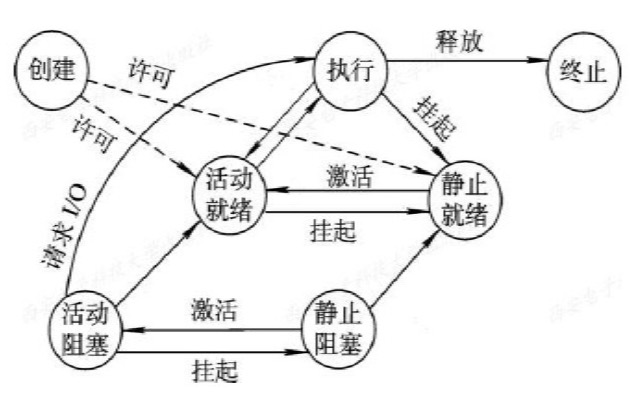

# 前言

在传统的 `OS` 中，为了提高**资源利用率**和**系统吞吐量**，通常采用多道程序技术：将多个程序同时装入内存，并使之并发执行。传统意义上的程序已经不能够独立运行了。此时作为**资源分配**和**独立运行**的基本单位是**进程**。

# 程序的执行

## 程序的顺序执行

特征：

- 顺序性
- 封闭性：程序在封闭的环境下运行，程序独占系统资源，资源的状态（除初始状态）只有当前执行的程序能够改变。程序运行的结果不受外界干扰。
- 可再现性：只要初始条件相同，重复执行结果相同。

## 程序的并发执行

顺序执行为程序员检测、矫正 bug 带来便利，但是系统资源利用率很低，从而引入了并发执行。

但是并不是所有的程序都能够并发执行，只有不存*前趋关系*的程序之间才有可能并发执行。

特征：

- 间断性：程序一些操作必须等到某个操作完成之后才能执行，在此之前必须等待，所以程序是“执行——暂停——执行”。
- 失去封闭性：多个并发执行的程序执行时，系统资源被这些程序共同影响，那运行结果也就必然受到其他程序的影响了。
- 不可再现性：失去封闭性也就导致了不可再现性了。

# 进程的描述

## 进程的定义

可以发现，如果让程序直接并发执行，其结果具有不可再现性，那程序就失去了运行的意义。为了能够让并发执行的程序依然能够再现，必须引入一些机制来保证程序并发执行是受控的。

而要实现这一目的，一定需要存储和程序有关的一些信息，为此引入了一种专门的数据结构————进程控制块，Process Control Block, `PCB`。利用`PCB`来描述进程，进而管理、控制进程。

由程序段、相关数据段和`PCB`共同组成了进程实体（又称进程映像）。

> 一般进程实体简称进程。所谓创建进程就是创建进程实体的`PCB`，撤销进程就是撤销`PCB`。

**定义：进程是进程实体的运行过程，是系统进行资源分配和调度的一个独立单位。**

## 进程的特征

- 动态性：进程实体的运行过程。
- 异步性：各自按照不可预估的速度独立地向前推进。
- 并发性：进程参与并发执行。
- 独立性：系统进行资源分配和调度的独立单位。

## 进程的状态及转换

- 就绪状态（Ready）：进程已经分配到除 CPU 以外的所有资源，称处于这种状态为就绪状态，一般按照一定的策略排成一个队列称之为*就绪队列*。
- 执行状态（Running）：进程正在执行，对于同一时刻只能有一个进程处于执行状态，但是如果是多处理及系统，则有可能多个进程同时处于执行状态。
- 阻塞状态（Block）：正在执行的进程发生某事件，比如 IO 请求，申请缓冲区失败等，暂时无法继续执行，这个时候 OS 重新调度，将处理机分配给其他处于就绪状态的进程。通常处于阻塞状态的进程也会排成一个队列————_阻塞队列_。在较大的系统中，为了减少队列操作开销，根据阻塞原因不同会设置不同的阻塞队列。

除了这些，通常系统又引入了两种转态状态：创建状态和终止状态。

- 创建状态：创建进程一般要经过多个步骤：
  1.  进程申请一个空白`PCB`，提携控制、管理进程的信息；
  2.  根据`PCB`中的资源表，为进程分配所需的所有资源
  3.  将进程转入就绪状态插入就绪队列。 
      但是如果进程所需资源暂时不能得到满足（比如内存不足），这时创建工作未完成，进程不能被调度执行，进程这个时候所处的状态就称为**创建状态**。
- 终止状态：进程的终止也是要经历多个步骤的：
  1.  等待 OS 进行善后处理；
  2.  清零 PCB 归还于系统。 
      进入终止状态的进程以后不能再执行，但是在 OS 中依然保留了一个 record（一些状态码、计时统计信息），供其他进程收集。一旦其他进程完成了信息的提取之后，OS 就删除该进程。

## 挂起操作和进程的状态转换

### 挂起操作的引入

- 终端用户的需要：用户需要让自己的程序暂停下来，便于对自己的程序进行研究、修改
- 父进程请求：考察、修改子进程，或者协调各个子进程的活动。
- 负荷调节的需要：系统有时候需要把不那么重要的任务挂起，来保证其他进程能够正常运行
- 操作系统的需要：OS 有时候需要挂起某些进程来检查运行中的资源使用情况，或者记录 log

### 引入挂起原语后三个进程状态的转换

- 活动就绪 -> 静止就绪
- 活动阻塞 -> 静止阻塞
- 静止就绪 -> 活动就绪
- 静止阻塞 -> 活动阻塞
  > 对应的原语：Suspend、Active

# 总结

进程大致的概念就到这里，详细信息请见后续文章。
